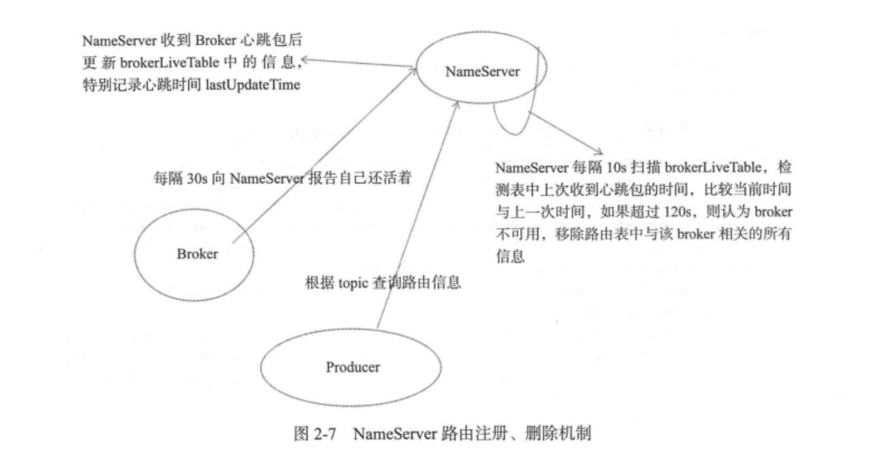

# 源码本地启动
# 分析启动日志，看源码
# 看example示例

# 看书
《RocketMQ技术内幕》

## 设计理念
* 采用发布-订阅模式
* 基于netty通信：每台broker与 namesrv 保持长链接


## namesrv
作用：为消息生产者和消息消费者提供关于Topic的路由信息，那么namesrv就需要存储路由的基础信息、能够管理broker节点，包括路由注册、路由删除



```markdown
Q: namesrv 集群之间互不通信
A: broker每30s向所有的namesrv报告自己还活着
```

```markdown
> Q: 路由注册
> A: 每30s向所有的namesrv发送一次心跳包
```

```markdown
Q: 路由删除
A: 每10s扫描一次, 120s没有收到心跳，则删除
？？问题：等Broker失效至少需要120s才能将broker从路由表中移除，如果在broker故障期间，消息生产者producer根据主题获取到的路由信息包含已经宕机的broker，会导致消息失败，怎么办？
```


```markdown
Q：路由发现
RockMQ的路由发现是非实时的，当Topic路由出现变化后，namesrv不主动推送给客户端，而是由客户端拉取定时拉取主题最新的路由
```


## 生产者
* 查找路由
* 选择队列
* 发送消息

## 存储
存储文件设计成文件组的概念，组内单个文件大小固定，方便引入内存映射机制
所有主题的消息存储基于顺序写
消息存储文件并不是永久存储在服务器端，提供了过期机制，默认保留3天


### 消息存储衡量标准：
1、消息堆积能力
2、消息的存储能力

### 影响消息可靠性：
1、Broker 正常关机
2、Broker 异常 Crash
3、OS Crash
4、机器断电，立即恢复供电

5、机器无法开机（CPU、主板、内存等关键设备损坏）
6、磁盘设备损坏


1 ~ 4 可以在同步刷盘机制下确保不丢失消息
5 ~ 6 单点故障，如果开启异步复制，能保证只丢失少量消息


* 内存映射文件 MappedFile
* CommitLog
* ConsumeQueue
* Index
* checkpoint


## 消费者
设计上允许重复消费（由消费者保证）

* 消息拉取
* 消息队列负载
* 消息消费
 
## 消息过滤
在broker端过滤
在消息消费端过滤

## 主从同步
* HA

## 定时消息
只支持特定延迟级别的延时消息

## 事务消息


# 工具：mqadmin.sh


