# 源码本地启动
？？best_practice.md
？？结合cn文档看一下


# 分析启动日志，看源码
# 看example示例

？？消息消费延迟怎么诊断
是发送没成功，还是消费没成功，怎么通过日志排查？


# 设计体系
？？结合图片看一下


# 看书
《RocketMQ技术内幕》

## 设计理念
* 采用发布-订阅模式
* 基于netty通信：每台broker与 namesrv 保持长链接
> broker 在和 name Server 进行通信的时候，作为的是 Netty 的客户端，在和生产者或者是消费者进行通信的时候，它做的是服务端


## 1.namesrv
作用：为消息生产者和消息消费者提供关于Topic的路由信息，那么namesrv就需要存储路由的基础信息、能够管理broker节点，包括路由注册、路由删除

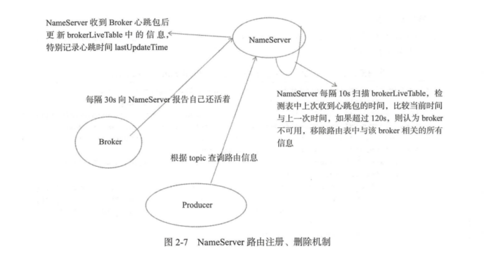

```markdown
Q: namesrv 集群之间互不通信
A: broker每30s向所有的namesrv报告自己还活着
```

```markdown
> Q: 路由注册
> A: 每30s向所有的namesrv发送一次心跳包
```

```markdown
Q: 路由删除
A: 每10s扫描一次, 120s没有收到心跳，则删除
？？问题：等Broker失效至少需要120s才能将broker从路由表中移除，如果在broker故障期间，消息生产者producer根据主题获取到的路由信息包含已经宕机的broker，会导致消息失败，怎么办？
```

```markdown
Q：路由发现
A：RockMQ的路由发现是非实时的，当Topic路由出现变化后，namesrv不主动推送给客户端，而是由客户端拉取定时拉取主题最新的路由
```


## 2.生产者
* RockMQ发送普通消息有三种方式：可靠同步发送、可靠异步发送、单项发送。

* 步骤
** 查找路由 
** 选择队列
** 发送消息

```markdown
Q: 消息发送如何进行负载？
A：取模求余默认轮询，会进行Broker故障规避
```

```markdown
Q: 消息发送如何实现高可用？
A：2个手段：
    (1) 重试 
    (2) Broker故障规避
```

```markdown
Q: 消息发送如何实现一致性？
A：
```

## 3.存储
从存储方式和存储效率上看，文件系统高于KV存储，KV存储高于关系型数据库。直接操作文件系统是最快的，但是可靠性是最低的。
存储的核心是IO访问性能

存储文件设计成文件组的概念，组内单个文件大小固定，方便引入内存映射机制
所有主题的消息存储基于顺序写
消息存储文件并不是永久存储在服务器端，提供了过期机制，默认保留3天


### 消息存储衡量标准：
1、消息堆积能力
2、消息的存储能力


### 影响消息可靠性：
1、Broker 正常关机
2、Broker 异常 Crash
3、OS Crash
4、机器断电，立即恢复供电

5、机器无法开机（CPU、主板、内存等关键设备损坏）
6、磁盘设备损坏


1 ~ 4 可以在同步刷盘机制下确保不丢失消息
5 ~ 6 单点故障，如果开启异步复制，能保证只丢失少量消息

### 文件存储目录
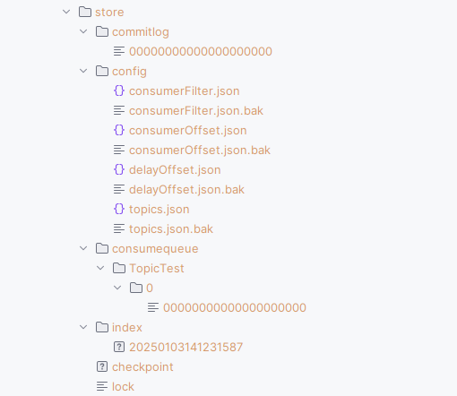
* commitlog，消息存储目录
* config，运行期间的一些配置信息
  * consumerFilter.json，主题消息过滤信息
  * consumerOffset.json，集群消费模式消息消费进度
  * delayOffset.json，延迟消息队列的拉取进度
  * subscriptionGroup.json，消息消费组配置信息
  * topics.json，Topic配置
* consumeQueue，消息消费队列存储目录
* index，消息索引文件存储目录
* checkpoint，文件检测点，存储commitLog文件最后一次刷盘时间戳、consumeQueue最后一次刷盘时间、index索引文件最后一次刷盘时间戳
* abort，如果存在abort文件表明broker非正常关闭，该文件默认启动时创建，正常退出之前删除
* lock


* 消息发送存储流程
 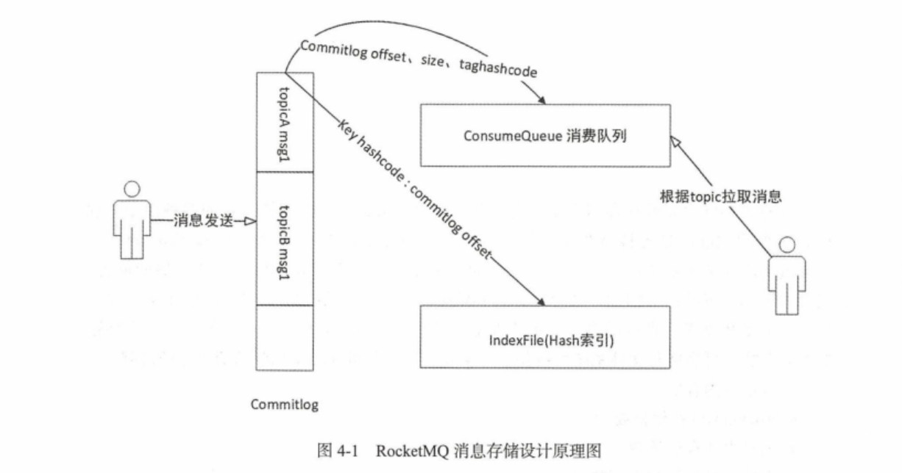
 
 

```markdown
Q: 如何进行查找实现？
A: 
```


* 存储文件组织与MappedFile（内存映射）
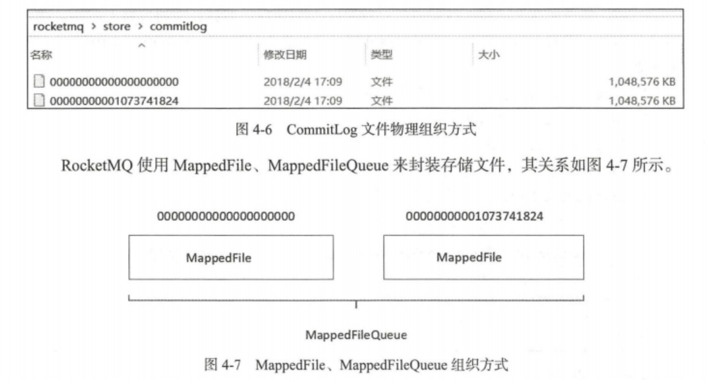
```markdown
Q: 如何提高IO的访问性能
A: 通过使用内存映射文件。无论是CommitLog、ConsumeQueue还是IndexFile，单个文件都被设计为固定长度
如果一个文件写满以后再创建一个新的文件，文件名为该文件第一条消息对应的全局物理偏移量。
```

* CommitLog 
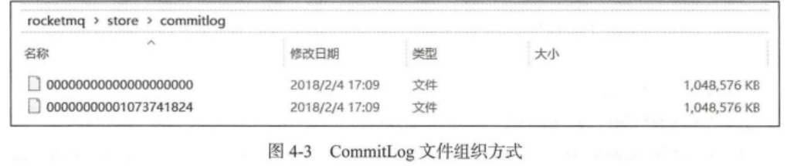
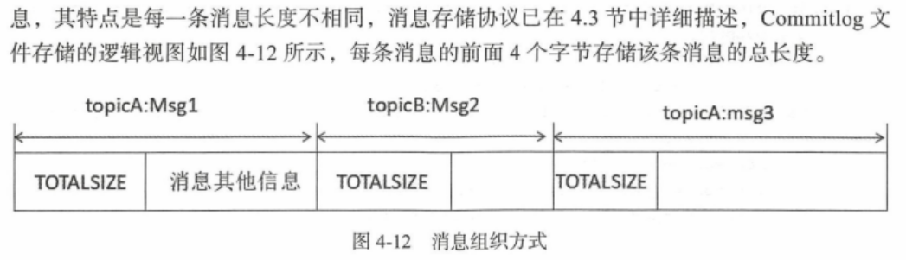
消息存储文件，所有消息主题的消息都存储在CommitLog文件中
默认大小是1G，一个文件写满后再创建另外一个，以该文件的第一个偏移量为文件名，偏移量小于20位，则用0补齐
示例：第一个文件的偏移量为0，第二个文件的1073741824，代表该文件中的第一条消息的物理偏移量为1073741824，这样根据物理偏移量就能快速定位到信息


```markdown
Q: commitlog如何产生，如何操作
A:
（1）commit log对应的是CommitLog类，CommitLog类里维护了一个 MappedFileQueue队列，MappedFileQueue  中有一个CopyOnWriteArrayList的数组，存储是的是MappedFile，每一个MappedFile对应的就是commit log文件夹里面的一个个文件，它的文件名是它的物理偏移量。 
当我们在操作文件的时候，可以通过fileChannel直接将文件映射到内存的buffer里（byteBuffer中）
（2）当broker在接收到消息进行存储的时候，会将消息按照固定的格式给它追加到byteBuffer里面。
格式如下，比如：
消息总长度、魔数、主题、消息消费队列ID、消息体body和属性properties、消息体crc校验码
Broker服务器IP + 端口号、消息发送者的IP地址
消息在CommitLog文件中的偏移量、消息在消息消费队列中的偏移量
（3）然后执行commit操作，会将ByteBuffer中的数据写会到FileChannel，
（4）最后通过FileChannel.force()进行刷盘，保证消息的持久化。以及主从同步操作
```

* 实时更新消息消费队列与索引文件
分发器处理


* ConsumeQueue
消息消费队列，消息到达commitlog文件后，将异步转发到消息消费队列中，供消息消费者消息
每个消息主题包含多个消息消费队列，每一个消息队列有一个消息文件
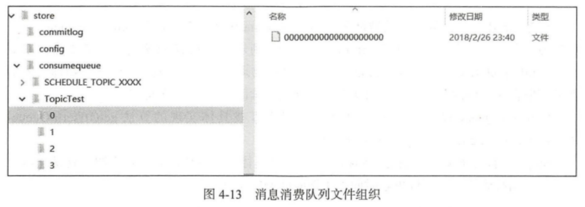
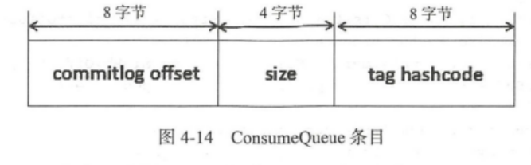

说明：结构
每个条目大小是 8(commitlog offset) + 4(size) + 8(tag hashcode) = 20Byte，最大是30W


核心类：
ConsumeQueue#putMessagePositionInfo


* Index
IndexFile索引文件，主要是为了加速消息的检索性能，根据消息的属性快速从CommitLog文件中检索消息
主要存储消息索引键与Offset的对应关系
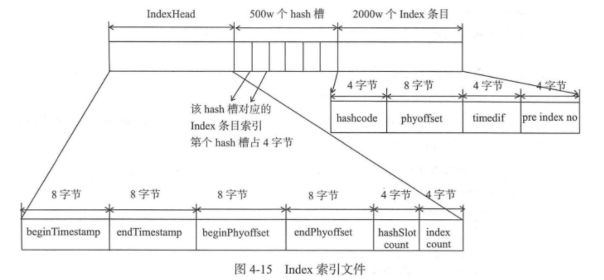

说明：结构
IndexHead(40={beginTimestampIndex=8 + endTimestampIndex=8 + beginPhyoffsetIndex=8 + endPhyoffsetIndex=8 + hashSlotcountIndex=4 + indexCountIndex=4})
    + hash槽位(500W，存储的是索引条目的下标，即第几个) 
    + + 索引条目（2000W, 20={hashcode=4 + phyOffset=8 + timeDiff=4 + preIndexNo=4}）

核心类：
IndexService#buildIndex


* checkpoint
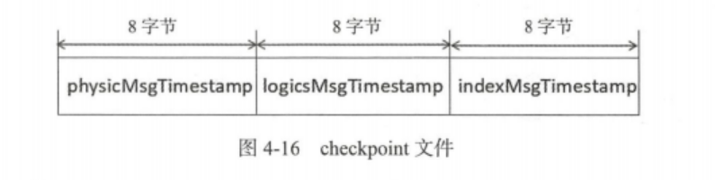
记录commitlog、consumequeue、index文件的刷盘时间点
说明：结构
physicMsgTimestamp=8 + logicsMsgTimestamp=8 + indexMsgTimestamp=8


* 消息队列与索引文件恢复
Q: 由于RocketMQ存储首先将消息全量存储在commitlog文件中，然后异步生成转发任务更新consumequeue、index文件。
如果消息成功存储到commitlog文件中，转发任务未成功执行，此时消息服务器由于某个原因宕机，导致commitlog、consumequeue、indexfile文件数据不一致。
如果不加以人工修复的话，会有一部分消息即在commitlog文件中存在，但是由于没有转发到consumequeue，这部分消息永远不会被消息消费者消费。

A: 存储文件加载流程
正常恢复
异常恢复
到commitlog，没到consumequeue和Index的消息，重新发一次


* 文件刷盘机制

同步刷盘
异步刷盘


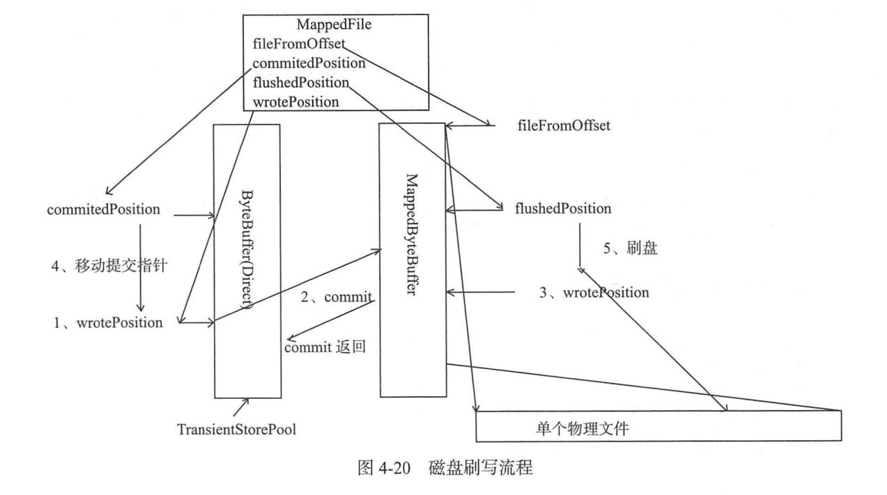

RocketMQ中的偏移量含义
??发送结果中的含义
msgId，消息ID生成器
offsetMsgId
queueOffset
consumeQueueOffset
queueId，选择的队列的id

物理偏移量
逻辑偏移量


* 过期文件删除机制
触发时机：
1.达到删除文件的时间点
2.磁盘空间不足
3.手工删除


## 4.消费者
设计上允许重复消费（由消费者保证）

* 消息拉取
* 消息队列负载
* 消息消费
 
* 消息的重试机制
* 定时消息原理


## 消息过滤
在broker端过滤
在消息消费端过滤

## 主从同步
* HA

一、从节点的作用：
1、数据冗余（主从同步）
主节点（Master）负责接收生产者发送的消息并写入CommitLog（存储文件）
从节点实时/异步同步主节点的数据，确保主节点宕机时，数据不会丢失

2、故障转移（Failover）
当主节点不可用时（如宕机、网络中断），从节点可以自动或手动切换为主节点，继续对外提供服务。


二、从节点是否参与消息消费？
1、默认情况下，消费者仅从主节点拉取消息。
RocketMQ的消费逻辑由主节点负责，从节点不直接处理消费请求。
这是为了避免主从数据同步延迟（如异步复制）导致消费者读到过期数据。

2、特殊情况，
如果主节点宕机且从节点切换为新的主节点，消费者会自动连接到新的主节点继续消费。
某些定制化场景中，可以通过配置强制消费者从从节点读取数据，但需权衡数据一致性和可用性（不推荐常规使用）


## 定时消息
只支持特定延迟级别的延时消息

## 事务消息


# 工具：mqadmin.sh
看namesrv端注册的broker等


# 参考资料
> https://blog.csdn.net/qq_51967234/article/details/139335713
> https://www.cnblogs.com/qdhxhz/p/11094624.html


